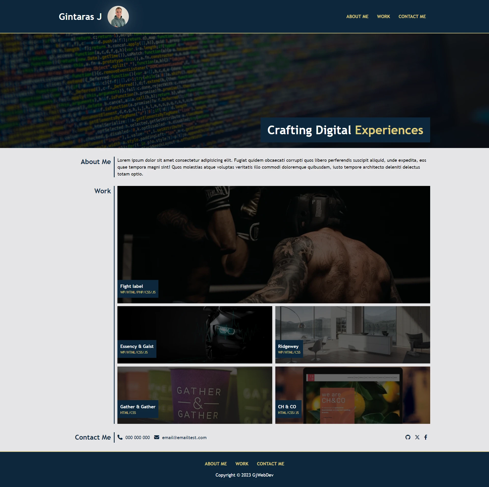

# Gintaras Jakimavicius - Web Developer Portfolio

## Description

This repository showcases the portfolio of Gintaras Jakimavicius, a web developer. It includes HTML and CSS code intended for presenting recent web projects. The HTML is dedicated to structuring the website for accessibility, and CSS is applied to enhance its visual appeal. The implementation of flexbox and grid ensures responsiveness, making the website adapt seamlessly to all devices.

For more details visit [project website](https://ginjak.github.io/gjwebdev/)

## Instalation

n/a

## Usage

## Credits

n/a

## License

This project is licensed under the [MIT License](./LICENSE)
